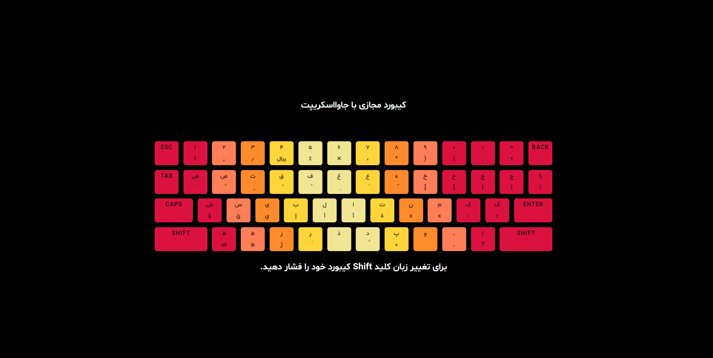

  <a href="#">
    <h2 align="center">On Screen Keyboard |  کیبورد مجازی</h2>
  </a>

# App Preview

---

Develop with JS and Support EN and FA language

## :rocket: Help

To change the language, first change the language of your keyboard and then press the Shift key on your keyboard.

<strong>Enjoy the app</strong>

---

Made with :heart: by Ghorbani-Dev1985
